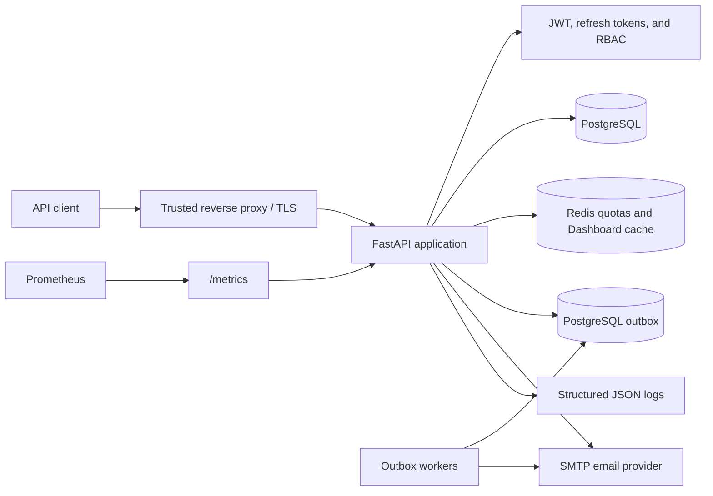
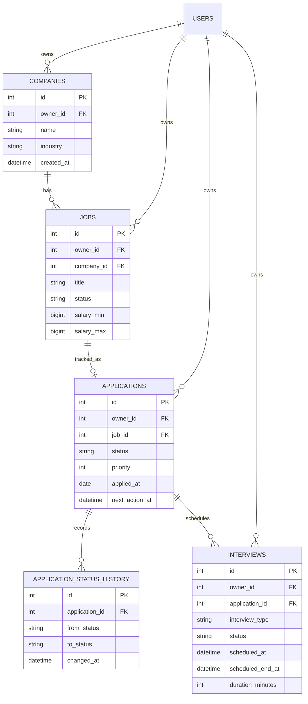
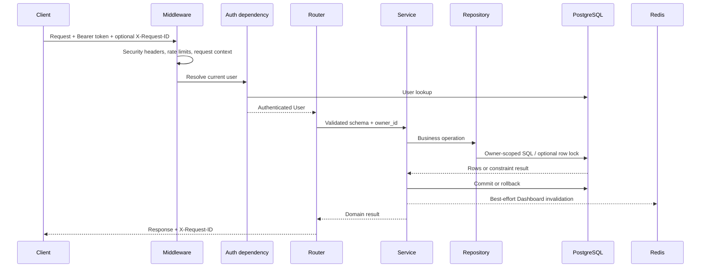
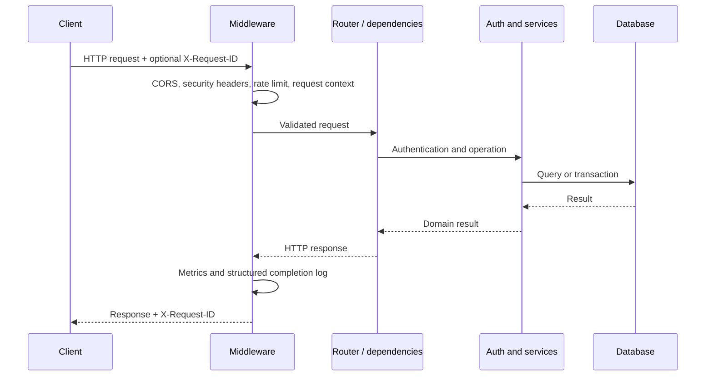

# JobTrack architecture guide

JobTrack is a synchronous, layered FastAPI application for tracking companies,
jobs, applications, status history, interviews, and dashboard actions. It keeps
HTTP concerns, business rules, persistence, and operations separate.

## System context

The reverse proxy terminates TLS and replaces untrusted forwarding headers.
Uvicorn accepts those headers only from the explicit `FORWARDED_ALLOW_IPS`
address/CIDR allowlist, then exposes one canonical ASGI client address to both
request logging and rate limiting. The application owns validation,
authorization, business transactions, and telemetry. PostgreSQL is required;
Redis becomes a required readiness dependency when distributed rate limiting is
enabled.

## JobTrack domain model

The repeated `owner_id` is intentional. It lets every public query enforce the
tenant boundary directly instead of trusting a previously loaded parent.
For scheduled Interviews, PostgreSQL also combines `owner_id` with the
half-open scheduled time range in a GiST exclusion constraint, so concurrent
transactions cannot reserve overlapping slots for one user.

## Authenticated business request flow

## Source layout and responsibilities

| Area | Path | Responsibility |
| --- | --- | --- |
| Application assembly | `src/app/main.py` | Create FastAPI, register middleware and handlers, include routers |
| HTTP routes | `src/app/api/v1/` | Parse requests, enforce dependencies, return response models |
| Authentication | `src/app/auth/` | Password verification, JWT validation, refresh rotation, permissions |
| Configuration | `src/app/core/` | Environment settings, Redis lifecycle, logging, metrics, request context |
| Persistence | `src/app/db/`, `src/app/models/`, `src/app/repositories/` | Sessions, ORM models, and data access |
| Contracts | `src/app/schemas/` | Pydantic request and response models |
| Cross-cutting HTTP behavior | `src/app/middlewares/` | CORS, headers, rate limiting, request logging |
| Durable work | `src/app/services/outbox.py`, `src/app/services/outbox_worker.py` | Atomic enqueue, encryption, leasing, retries, and terminal handling |
| Error boundary | `src/app/exceptions/` | Stable client errors and safe unexpected-error responses |
| Schema evolution | `alembic/` | Ordered PostgreSQL migrations |
| Verification | `tests/` | Endpoint, security, failure-path, and operational tests |
| Database evaluation | `benchmarks/` | Opt-in sync baseline and isolated async prototype; never imported by production startup |

Routers should remain thin: validate input, compose dependencies and services,
and translate results into HTTP responses. Reusable authentication or database
behavior belongs outside route modules.

## Request lifecycle

Global exception handlers keep validation, HTTP, and unexpected failures
consistent. Unexpected exceptions are logged with their correlation ID while
the response omits internal details.

## Authentication lifecycle

1. `POST /register/` hashes the password with bcrypt before committing a user.
2. `POST /login/` verifies the password, creates a short-lived JWT access token,
   creates an opaque refresh token, and stores only the refresh-token hash.
3. Protected routes decode the JWT and validate algorithm, issuer, audience,
   expiration, token type, and subject. The current user is then loaded from the
   database, so deleted users, disabled users, and role changes take effect
   without waiting for a new access token.
4. `POST /auth/refresh` validates the stored token, rejects revoked or expired
   records, locks and revokes the old token, and commits a replacement in the
   same server-generated family. Replay of a rotated token revokes the family's
   live descendant.
5. `POST /auth/logout` revokes the submitted refresh-token family.
6. Disabling a user through the admin status endpoint atomically marks the
   account inactive and revokes every refresh-token session. Existing access
   tokens fail the current-user lookup, and re-enabling the account does not
   restore revoked sessions.
7. Registration may attach a normalized email identity. Verification requests
   invalidate older outstanding tokens, persist only a SHA-256 token hash, and
   deliver the raw token through the configured SMTP boundary.
8. Confirmation locks and atomically consumes the scoped token while setting
   `email_verified_at`. Expiry, replay, purpose, and current-email checks occur
   before the transaction commits.
9. Password-reset requests reuse the account-action token table with a distinct
   purpose and only accept active, verified email identities without revealing
   eligibility to the caller.
10. Reset confirmation locks both token and user, updates the password hash,
   consumes outstanding reset tokens, and revokes every refresh token in one
   transaction. It creates no replacement session.
11. Authenticated session endpoints aggregate active refresh-token families and
    allow idempotent revocation of one or all families while filtering every
    operation by current user ownership.
12. Interview creation locks the owner-scoped Application and permits new
    rounds only in `screening`, `interview`, or `offer`. Later terminal
    Application transitions do not prevent completing or cancelling existing
    Interviews.
13. TOTP enrollment encrypts the authenticator seed with a dedicated Fernet
    key. Confirmation stores only hashes of newly generated recovery codes.
14. Login for an MFA-enabled account returns a short-lived, opaque challenge
    instead of session tokens. Successful TOTP or recovery verification consumes
    the challenge and creates the device session in one transaction.
15. Accepted TOTP counters are recorded to reject replay in the same time step.
    Access tokens record authentication methods (`amr`) and time (`auth_time`);
    refresh-issued access tokens use `amr=["refresh"]` and cannot satisfy recent
    MFA step-up checks.
16. OIDC authorization creates a short-lived database transaction containing
    hashes of `state`, nonce, and browser binding plus an encrypted PKCE verifier.
    The authorization request always uses Authorization Code and PKCE S256.
17. The callback validates browser binding, discovery issuer, ID-token signature,
    algorithm, issuer, audience, authorized party, lifetime, subject, and nonce
    before consuming the transaction and issuing a local device session.
18. External identities use immutable `(issuer, subject)` keys. Matching email
    never links an existing account; linking requires a recent authenticated
    local session. Identity changes revoke refresh sessions.
19. Optional Redis cache-aside stores only validated public OIDC discovery and
    JWKS documents under versioned issuer-digest keys. Every cache read is
    validated again. Misses use a bounded refresh lock; Redis errors bypass to
    the provider. An unknown cached `kid` forces one provider JWKS refresh.

Refresh-token families detect replay and make device-level revocation possible.
Access tokens are stateless and logout does not revoke them, so clients must
discard them on logout and deployments must protect the signing secret. A
protected request still reloads the user, allowing deletion or account disable
to reject an otherwise unexpired access token.

## Authorization model

Authentication answers who the user is; authorization decides what that user
may do. Admin routes call the centralized permission check after resolving the
current database user. New roles or permissions should be added centrally and
covered by both allow and deny tests.

## Data and transaction boundaries

Each request receives a SQLAlchemy session through a FastAPI dependency. Write
operations explicitly commit only after all required mutations are ready and
roll back when persistence fails. Alembic migrations are the source of truth
for schema changes.

Production releases should run migrations once before starting new application
workers. Do not let every worker race to apply schema changes.

The production persistence path remains synchronous for v1.3.0. The asyncpg
engine under `benchmarks/` exists only for controlled comparison and preserves
equivalent SQL and transaction boundaries. It is not an alternate application
dependency. See [DATABASE_BENCHMARKS.md](DATABASE_BENCHMARKS.md) and
[ADR 0001](docs/decisions/0001-keep-sync-sqlalchemy.md) for the evidence gate
and decision rationale.

In transactional delivery mode, the lifecycle token and encrypted outbox row
commit together. Workers claim due rows in short `FOR UPDATE SKIP LOCKED`
transactions, commit leases before SMTP I/O, and condition finalization on the
lease owner. Expired leases are recoverable. SMTP remains an external
at-least-once boundary, so duplicate delivery is possible after ambiguous
provider acceptance. Success and dead-letter transitions purge encrypted
payloads.

## Observability model

- `/health/live` reports process liveness without dependency checks.
- `/health/ready` verifies PostgreSQL and, when configured, Redis connectivity
  before accepting traffic.
- `/metrics` exports bounded-label request count, status, latency, and
  in-progress metrics.
- JSON request logs carry method, normalized path, status, duration, and a
  validated correlation ID.
- Rate-limit metrics use only bounded backend, outcome, and operation labels.
- Outbox metrics use bounded message types, outcomes, and failure categories;
  worker logs never include recipients, tokens, ciphertext, or provider details.
- OIDC cache/provider metrics use only bounded document and outcome labels;
  issuer URLs, key IDs, documents, tokens, and credentials are excluded.

Read [MONITORING.md](MONITORING.md) for scrape configuration, multi-worker
metrics, alerts, and troubleshooting.

## Trace propagation boundary

Tracing is disabled by default. When enabled, the application uses W3C Trace
Context across supported request and worker boundaries.

Transactional outbox rows persist only bounded `traceparent` and `tracestate`
fields so a worker can continue the originating trace after the enqueue
transaction has committed.

Trace metadata remains separate from the encrypted lifecycle payload. Retryable
jobs retain trace context so later attempts remain correlated; successful and
dead-letter jobs purge the stored trace metadata.

Malformed or oversized propagation values are ignored safely. W3C baggage is
not persisted through the outbox.

Tracing must not change leasing, idempotency, retry behavior, transaction
correctness, SMTP delivery semantics, readiness, or application availability.

## Configuration and trust boundaries

Settings come from environment variables and `.env`; process environment values
take precedence. Production validation rejects debug mode and short or known
placeholder secrets. SMTP delivery is opt-in and requires a host and sender;
disabled delivery does not create unreachable tokens. MFA and OIDC transaction
data use dedicated encryption keys rather than the JWT signing secret. Redis
quota keys contain only versioned HMAC identifiers and bounded fixed-window
counters. OIDC cache keys contain a fixed issuer digest, document kind, and
bounded TTL; values contain only public discovery/JWKS JSON. Proxy trust is
fail-closed by default but its exact CIDRs, along with CORS origins, metrics
exposure, database permissions, and secret storage, remain deployment
responsibilities.

## Safe extension points

- Add a route in `src/app/api/v1/` and register its router in `main.py`.
- Put new request and response contracts in `src/app/schemas/`.
- Isolate reusable business rules in services and data access in repositories.
- Create an Alembic revision for every schema change.
- Add success, authorization, validation, rollback, and edge-case tests.
- Add low-cardinality metrics; never use usernames, IDs, or raw URLs as metric
  labels.

Run `python scripts/dev.py check` before review.

## Intentional limitations

Memory rate limiting remains available for single-process use; shared quotas
require Redis. Redis Cluster and cross-region quota guarantees are not included.
Refresh-token persistence and SMTP delivery are synchronous, and the repository
does not include phishing-resistant MFA, immediate JWT revocation, a
general-purpose application cache, or a production container image. Password
reset revokes refresh tokens, but existing stateless access tokens remain valid
until expiry. SMTP acceptance is not a durable delivery guarantee; applications
requiring that guarantee should add a transactional outbox and worker. These
are explicit roadmap items rather than hidden production claims. See
[ROADMAP.md](ROADMAP.md) and [DEPLOYMENT.md](DEPLOYMENT.md) before adopting the
foundation.
