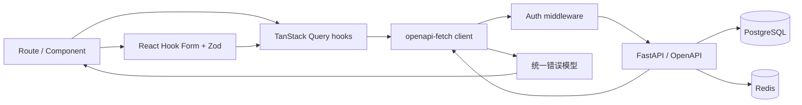

# JobTrack 前端搭建计划

> 文档状态：阶段 F0、F1、F2、F3、F4、F5、F6、F7 已完成；账号恢复 UI 增强已完成
> 调研日期：2026-09-23
> 项目定位：为现有 JobTrack FastAPI 后端建设一个可真实使用、可完整演示、也能经得起面试追问的现代化 Web 前端。

当前进度：

- 阶段 F0 已完成：Application 和 Interview 聚合 read model 已实现，列表查询使用关联预加载避免 N+1。
- React、TypeScript、Vite、Tailwind CSS、TanStack Query、openapi-fetch、Vitest、Testing Library 和 MSW 基线已建立。
- FastAPI OpenAPI 导出和 TypeScript 类型生成可复现，CI 已加入依赖安装、契约漂移、lint、格式、类型、测试和构建门禁。
- 阶段 F1 已完成：登录、注册、MFA challenge、会话恢复、单飞 refresh、受保护路由、响应式应用外壳、主题、Toast/Dialog、错误边界与通用状态均已实现并通过测试。
- 阶段 F2 已完成：公司与职位的筛选、分页、详情、创建、编辑、删除及 404/409/422 错误反馈均已接入；职位响应新增预加载的 `company_summary` read model。
- 阶段 F3 已完成：投递列表、URL 筛选/排序/分页、创建编辑、详情、看板、合法状态迁移、终态折叠、状态历史时间线和删除冲突反馈均已实现。
- 阶段 F4 已完成：FullCalendar Standard 月/周/列表视图、可见范围加载、日期创建、详情编辑、完成/取消、删除、本地时区往返及 409 重叠冲突反馈均已实现；日历采用路由级懒加载。
- 阶段 F5 已完成：Dashboard 真实 KPI、状态分布、Offer 转化率、近期面试、逾期/近期行动、演示账号标识和首次使用引导均已接入；所有统计来自后端聚合 read model，卡片与状态可进入对应业务页面。
- 阶段 F6 已完成：MFA 本地二维码绑定、一次性恢复码、恢复码重置、MFA 禁用、设备会话查看与撤销均已接入；会话撤销后的本地认证与缓存清理遵循后端契约。
- 阶段 F7 已完成：Playwright 真实后端关键流程、多阶段非 root 前端镜像、Nginx 同源代理/SPA 回退/安全响应头、Compose frontend 服务和 CI 浏览器/镜像门禁均已接入。
- 账号恢复 UI 增强已完成：邮箱验证邮件申请/令牌确认、密码重置邮件申请/新密码确认均已接入；敏感令牌进入组件后立即从地址栏清除，请求结果使用防账号枚举文案，密码重置成功后清理本地认证状态。
- 下一步：F0–F7 主计划已完成；后续按需评估看板拖拽、日历拖动、跨浏览器矩阵和生产部署自动化。

## 1. 结论先行

不直接套用一个现成 Job Tracker 项目，而是借鉴成熟项目的交互，用稳定的通用组件搭建自己的前端。

推荐技术路线：

```text
React + TypeScript + Vite
    + React Router
    + TanStack Query
    + openapi-typescript / openapi-fetch
    + React Hook Form + Zod
    + Tailwind CSS + shadcn/ui + Lucide Icons
    + FullCalendar Standard
    + Vitest + React Testing Library + MSW
    + Playwright
```

选择这条路线的原因：

- 它与现有 REST/OpenAPI 后端自然适配，不需要改成 Supabase、Firebase 或本地存储。
- shadcn/ui 提供可复制进项目、能够自行修改的组件源码，适合做有辨识度的作品，而不是套一个难以调整的后台模板。
- TanStack Query 专门处理请求缓存、失效、分页和 mutation，避免把服务端数据塞进全局状态仓库。
- OpenAPI 生成 TypeScript 类型，避免前后端各维护一套容易漂移的 DTO。
- FullCalendar Standard 已覆盖月、周、日程列表和交互能力，不需要购买 Premium 资源排期功能。
- 测试、CI、Docker 和可访问性都能形成一条完整工程链路，面试时不只有页面截图可讲。

首版不使用 Next.js。这个项目是登录后的 SPA 管理应用，没有 SEO 和服务端渲染需求；Vite 架构更简单，也更能把重点放在 API 集成、状态管理和业务交互上。

## 2. 调研结果

### 2.1 可参考的开源项目

| 项目 | 值得借鉴 | 不直接采用的原因 |
| --- | --- | --- |
| [RoleReady](https://github.com/NoName95x/RoleReady) | 看板式投递流程、统计卡片、响应式布局、深浅主题 | 主要使用本地存储和 Context，数据层、认证和当前 FastAPI 后端不匹配 |
| [yewen-jin/job-tracker](https://github.com/yewen-jin/job-tracker) | Dashboard、状态筛选、每日计划、详情交互 | 使用 Supabase 认证与数据库；直接移植会绕过本项目最有价值的后端能力 |

这些项目适合用于观察信息层级和用户流程，不适合复制其数据架构。若以后复用任何源码或素材，必须先单独核对对应版本的许可证；本计划默认只参考交互思想。

### 2.2 组件调研

| 能力 | 选型 | 结论 |
| --- | --- | --- |
| 应用外壳 | shadcn/ui Sidebar、Sheet、Dropdown Menu | 可做桌面折叠侧栏和移动端抽屉，视觉可完全定制 |
| 数据列表 | shadcn/ui Data Table + TanStack Table | 适合公司、职位和投递的筛选、排序、列显示、分页 |
| 图表 | shadcn/ui Chart（基于 Recharts） | 与主题变量一致，适合漏斗分布和转化率，不另引入重型图表库 |
| 日期选择 | shadcn/ui Calendar（基于 React DayPicker） | 用于日期和时间表单，不承担完整日程视图 |
| 面试日历 | FullCalendar Standard | 提供月/周/列表视图、日期点击和事件交互；只使用 MIT Standard 插件 |
| 拖拽 | `dnd-kit`，延后到增强阶段 | 仅允许后端状态机认可的目标；不能让拖拽绕过业务规则 |
| 图标 | Lucide React | 和 shadcn/ui 风格一致，图标统一且支持 tree-shaking |

不选择现成 Admin Dashboard 模板。模板虽然能快速获得“后台感”，但通常带来多余依赖、难以解释的代码和同质化视觉；本项目页面数量有限，用基础组件组装更可控。

## 3. 产品目标与范围

### 3.1 首版必须完成

登录用户能够：

1. 注册、登录、刷新会话和退出；启用 MFA 的账号能够完成二次验证。
2. 查看 Dashboard 的公司、职位、投递状态、Offer 转化、近期面试和待办。
3. 创建、查看、编辑和删除公司。
4. 创建、查看、编辑和删除职位，并按公司、状态等条件筛选。
5. 创建投递、查看列表和看板、执行合法状态流转并查看状态历史。
6. 创建和管理面试，在月历、周视图和列表之间切换。
7. 正确呈现后端的校验、权限、冲突、限流和依赖故障信息。
8. 在桌面和手机尺寸上完成核心流程。

### 3.2 首版明确不做

- 不做公开营销首页、SEO、服务端渲染或移动 App。
- 不在浏览器重新实现后端统计规则，也不展示后端没有提供依据的“伪趋势图”。
- 不实现富文本编辑器、附件上传、简历解析和 AI 功能。
- 不先做管理员后台；它对求职投递主流程的演示价值较低。
- 不使用 FullCalendar Premium 的资源排期功能。
- 不让前端自己决定合法状态迁移，后端始终是最终规则来源。

## 4. 用户体验与视觉方向

整体风格定位为“专注、可信、数据密度适中”的个人工作台，而不是传统企业后台。

- 主色：Slate/Ink 中性色，搭配 Emerald 或 Cyan 作为行动强调色。
- 状态色：进行中用蓝色，面试用紫色，Offer 用绿色，拒绝用红色，撤回/归档用灰色；颜色之外同时显示文字或图标。
- 排版：清晰区分页面标题、关键指标、正文和辅助信息，表格保持紧凑但不拥挤。
- 动效：只保留侧栏、抽屉、状态变化和骨架屏的轻量过渡，尊重 `prefers-reduced-motion`。
- 主题：首版支持亮色和暗色，使用 CSS 变量统一图表、状态和组件颜色。
- 可访问性：键盘可操作、可见焦点、表单 label、Dialog 焦点管理、语义化状态提示，并检查对比度。

### 4.1 应用骨架

```text
┌────────────────────────────────────────────────────────────┐
│ Sidebar        │ Topbar: 页面标题 / 快捷新增 / 主题 / 用户 │
│                ├───────────────────────────────────────────┤
│ Dashboard      │                                           │
│ Applications   │              Page Content                 │
│ Interviews     │                                           │
│ Jobs           │       filters / cards / table / board     │
│ Companies      │                                           │
│ Settings       │                                           │
└────────────────────────────────────────────────────────────┘
```

- 桌面端侧栏可折叠，只保留图标。
- 移动端侧栏变为 Sheet；表格优先切换为卡片列表，而不是强行横向压缩。
- 全局“快速新增”可创建公司、职位、投递或面试。
- 加载状态使用与内容形状一致的 Skeleton；空状态要说明下一步动作。

## 5. 信息架构和页面

| 路由 | 页面 | 核心内容 | 优先级 |
| --- | --- | --- | --- |
| `/login` | 登录 | 账号密码、错误提示、MFA 分支 | P0 |
| `/register` | 注册 | 用户名、邮箱、密码、成功引导 | P0 |
| `/mfa/challenge` | 二次验证 | TOTP/恢复码验证 | P0 |
| `/dashboard` | 总览 | KPI、状态分布、Offer 转化、面试、待办 | P0 |
| `/applications` | 投递列表 | 搜索、组合筛选、排序、分页、批量视图切换 | P0 |
| `/applications/board` | 投递看板 | 按状态分组、合法迁移入口、终态折叠区 | P0 |
| `/applications/:id` | 投递详情 | 职位公司摘要、状态时间线、下一步、面试 | P0 |
| `/interviews` | 面试日历 | 月/周/列表视图、创建和详情抽屉 | P0 |
| `/jobs` | 职位 | 筛选表格/移动卡片、CRUD | P0 |
| `/jobs/:id` | 职位详情 | 公司、薪资、链接、描述、关联投递 | P0 |
| `/companies` | 公司 | 搜索、表格/卡片、CRUD | P0 |
| `/companies/:id` | 公司详情 | 基本信息、关联职位 | P1 |
| `/settings/security` | 安全设置 | MFA、设备会话、撤销会话 | P1 |
| `/verify-email`、`/forgot-password`、`/reset-password` | 账号恢复 | 邮箱验证申请/确认和密码重置申请/确认 | P2 |

404、403/会话失效、通用错误边界和离线提示属于横切页面，不能等最后才补。

## 6. 关键交互设计

### 6.1 Dashboard

- 第一行：公司数、职位数、活跃投递数、Offer 转化率。
- 中部：投递状态分布图；数据直接来自 Dashboard API。
- 下部：即将到来的面试、逾期行动、近期行动。
- 点击卡片或图表区块进入带对应筛选条件的列表，筛选条件写入 URL。
- 当前 API 只提供最近 7 天投递数量而非每日序列，因此首版不绘制虚假的 7 日折线图。

### 6.2 投递列表与看板

- 列表是数据管理主视图，支持状态、公司、日期、优先级和下一行动筛选。
- 看板列按现有状态机展示：`saved → applied → screening → interview → offer → archived`，`rejected` 和 `withdrawn` 放在可折叠终态区。
- 第一版通过“更改状态”菜单选择后端允许的下一状态，成功后刷新详情、历史、列表和 Dashboard 缓存。
- 增强阶段再加入拖拽；只启用合法目标，后端返回 409 时回滚并解释原因。
- 不对状态更新做不可逆的盲目乐观更新；等待服务端确认，或保留可靠快照用于回滚。

### 6.3 面试日历

- FullCalendar 使用 `dayGridMonth`、`timeGridWeek` 和 `listWeek` 三种 Standard 视图。
- 点击日期打开创建抽屉；点击事件打开详情；手机默认使用列表视图。
- 所有输入按浏览器本地时区展示，提交前转为 ISO 8601 UTC；日期型字段保持 `YYYY-MM-DD`，避免跨时区偏移。
- 首版不支持拖动改期，防止用户无意触发时间重叠；增强阶段可在 `eventDrop` 后请求后端，409 时调用回滚。
- 后端已有 15–480 分钟限制和重叠约束，前端提供即时提示，但不替代服务端校验。

## 7. 前端架构

### 7.1 目录建议

```text
frontend/
├── src/
│   ├── app/                  # Router、Provider、全局错误边界
│   ├── api/                  # 生成类型、API client、错误归一化
│   ├── components/
│   │   ├── ui/               # shadcn/ui 源码
│   │   ├── layout/           # Sidebar、Topbar、PageHeader
│   │   └── shared/           # EmptyState、StatusBadge、ConfirmDialog
│   ├── features/
│   │   ├── auth/
│   │   ├── dashboard/
│   │   ├── companies/
│   │   ├── jobs/
│   │   ├── applications/
│   │   ├── interviews/
│   │   └── settings/
│   ├── lib/                  # 日期、格式化、常量和小型工具
│   ├── styles/
│   └── test/                 # MSW handlers、测试渲染器
├── e2e/
├── public/
├── nginx.conf
├── Dockerfile
├── package.json
└── vite.config.ts
```

每个 `features` 模块内部按 `components`、`queries`、`forms` 和 `routes` 组织。组件不能直接散落调用 `fetch`；网络访问通过统一 client 和 feature query hooks 完成。

### 7.2 数据流



- TanStack Query 管服务端状态、缓存、重试和失效。
- React Context 只保存当前认证会话和少量应用级依赖。
- 主题、侧栏开关等简单 UI 状态保持本地；首版不引入 Redux。
- 搜索、筛选、排序、分页写入 URL search params，使刷新、后退和分享链接都可复现。
- 表单使用 React Hook Form；Zod 负责即时交互校验，FastAPI 仍负责最终业务校验。

### 7.3 API 类型和请求客户端

1. 从 FastAPI `/openapi.json` 导出一个可复现的 OpenAPI 文件。
2. 使用 `openapi-typescript` 生成只读 TypeScript 类型；生成文件禁止手改。
3. 使用 `openapi-fetch` 建立轻量 client，避免再手写重复 DTO。
4. CI 重新生成并检查 diff，后端接口变化必须同步前端。
5. 建立集中式 query key，例如：

```text
companies.list(filters)
jobs.list(filters)
applications.list(filters)
applications.detail(id)
applications.history(id)
interviews.list(range)
dashboard.current()
```

6. mutation 成功后精确失效相关查询，避免粗暴清空全部缓存。

### 7.4 错误处理

统一转换并显示：

| 状态码 | 前端行为 |
| --- | --- |
| 401 | 尝试一次 token refresh；失败则清理会话并返回登录页 |
| 404 | 展示资源不存在，不暴露是否为越权资源 |
| 409 | 在表单或操作附近说明状态迁移、删除依赖或时间冲突 |
| 422 | 将字段错误映射到对应控件，非字段错误显示在表单顶部 |
| 429 | 显示操作过快及可重试时间，禁用连续提交 |
| 503 | 说明服务暂时不可用并提供重试，不伪装成空数据 |

错误详情页和反馈中显示后端返回的 request ID，方便演示从前端错误追踪到结构化日志。

## 8. 认证与浏览器安全

现有后端把 access token 和旋转 refresh token 放在 JSON 响应体中，并未设置 HttpOnly Cookie。因此前端无法把当前方案描述成“XSS 不可读取”。

首版采用以下折中：

- access token 只保存在内存中。
- refresh token 保存在 `sessionStorage`，关闭浏览器标签页后失效；默认不提供“永久登录”。
- 应用启动时若存在 refresh token，执行一次刷新并恢复用户信息。
- 同一时刻只允许一个 refresh 请求；其他 401 等待同一个 Promise，避免旋转 token 被并发消费。
- 刷新成功后原子替换 refresh token，只重试原请求一次。
- 刷新失败、主动退出或撤销当前会话后，清空内存和 `sessionStorage`。
- 不在日志、错误监控、URL 或 React Query Devtools 中输出 token。
- 保持严格 CSP，不使用 `dangerouslySetInnerHTML`，并依赖 React 默认转义降低 XSS 风险。

长期更安全的方案是后端改为 Secure、HttpOnly、SameSite Cookie，或者增加同源 BFF。这个改变涉及 CSRF、跨域和刷新接口契约，不作为前端搭建阶段的顺手改动，而应单独写 ADR 和迁移测试。

登录接口使用 OAuth2 form data，而不是 JSON；请求还应带 `X-Device-Name`。登录返回 MFA challenge 时转到 `/mfa/challenge`，不能把它当成普通 token 响应。

## 9. 当前后端契约与缺口

### 9.1 已能直接支撑的页面

| 前端功能 | 后端能力 |
| --- | --- |
| 登录/注册/当前用户 | `/login/`、`/register/`、`/auth/me` |
| 刷新/退出 | `/auth/refresh`、`/auth/logout` |
| MFA | `/auth/mfa/*` |
| 会话管理 | `/auth/sessions*` |
| Dashboard | `GET /api/v1/dashboard` |
| 公司 | `/api/v1/companies` |
| 职位 | `/api/v1/jobs` |
| 投递和状态历史 | `/api/v1/applications`、`/{id}/status`、`/{id}/history` |
| 面试 | `/api/v1/interviews`、`/upcoming` |

### 9.2 前端实施前建议补的读模型

当前 Application 响应主要只有 `job_id`，Interview 响应主要只有 `application_id`。如果列表和日历要展示“公司 + 职位”，前端只能额外加载 Job 和 Company，再自己拼接。

可先用 TanStack Query 缓存实体映射完成 MVP，但不应长期依赖一次性拉取 100 条记录或逐条请求。建议在核心页面开工前增加两个后端只读增强：

1. 投递列表/详情包含轻量 `job_summary` 和 `company_summary`。
2. 面试列表/详情包含轻量 `application_summary`、职位名和公司名。

这不是把 ORM 全量嵌套返回，而是为 UI 定义稳定的 read model。它能消除 N+1 风险，也使分页、搜索和日历事件标题由服务端契约保证。

可选增强：为 Applications 增加服务端关键字搜索；为 Interviews 增加 `scheduled_from`、`scheduled_to` 范围参数，让日历只加载当前可见区间。

## 10. 分阶段实施计划

### 阶段 F0：契约和设计基线（已完成）

任务：

- 创建 `frontend/`、Vite React TypeScript 严格模式和 npm lockfile。
- 固定受支持的 Node LTS，并写入开发文档和 CI。
- 建立 OpenAPI 导出、类型生成和 API drift 检查。
- 确定色彩、间距、圆角、状态色和响应式断点。
- 建立 ESLint、Prettier、Vitest、Testing Library、MSW 基线。
- 决定并实现上述聚合 read model，或明确记录 MVP 临时拼接策略。

验收：空应用可启动、构建、测试；API client 能以生成类型访问健康接口；CI 能发现类型漂移。

### 阶段 F1：认证和应用外壳（已完成）

任务：

- 完成登录、注册、MFA challenge、退出和当前用户恢复。
- 实现单飞 refresh、受保护路由和会话失效处理。
- 完成 Sidebar、Topbar、移动导航、主题和全局 Toast/Dialog。
- 建立错误边界、404、Skeleton、Empty State。

验收：普通账号和 MFA 账号均能进入受保护页面；刷新浏览器可恢复会话；失效 token 不产生刷新风暴。

### 阶段 F2：公司和职位纵向切片（已完成）

任务：

- 公司列表、详情、创建、编辑、删除确认。
- 职位列表、详情、创建、编辑、筛选、排序、分页。
- 处理“公司下存在职位”和“职位下存在投递”的 409 冲突。
- 桌面表格和移动卡片使用同一查询状态。

验收：从新建公司到新建职位的完整路径可操作；422、404、409 都有可理解反馈；刷新后筛选仍保留。

### 阶段 F3：投递核心流程（已完成）

任务：

- 完成投递列表、组合筛选、详情页和状态历史时间线。
- 完成看板布局、合法状态动作、优先级和下一行动编辑。
- 关联 Job/Company 摘要，mutation 后精确刷新相关缓存和 Dashboard。
- 编写状态迁移组件测试和端到端主流程。

验收：能够从 Saved 完整推进到 Offer/Archived，也能走 Rejected/Withdrawn 分支；非法跳转由前后端共同阻止且数据不漂移。

### 阶段 F4：面试日历（已完成）

任务：

- 接入 FullCalendar Standard 的月、周、列表视图。
- 完成创建、编辑、取消/完成、删除和详情抽屉。
- 处理时区、15–480 分钟限制和 409 时间重叠。
- 移动端默认列表视图，日历只请求可见时间范围（若后端已增加范围参数）。

验收：创建面试后在正确的本地时间显示；重叠面试不会错误留在日历中；月/周切换不会全量重复请求。

### 阶段 F5：Dashboard 和演示体验（已完成）

任务：

- 完成 KPI、状态分布、转化率、面试和待办组件。
- 卡片和图表跳转至带筛选的对应页面。
- 增加演示数据状态、首次使用引导和关键空状态。
- 打磨响应式、暗色主题、键盘操作和加载体验。

验收：使用 `scripts/seed_demo.py` 后，从 Dashboard 可以进入并讲通公司→职位→投递→面试的完整故事；页面没有伪造统计。

### 阶段 F6：安全设置与增强交互（已完成）

任务：

- 完成 MFA 启用、确认、恢复码展示/复制/下载、重置和禁用流程。
- 使用本地 `qrcode` 生成 TOTP 二维码，不向外部服务发送密钥。
- 完成设备会话列表、单个撤销和全部撤销，不伪造当前设备标识。
- 在恢复码重置、禁用 MFA 和撤销全部会话后按契约清理本地认证与 Query 缓存。
- 看板拖拽、日历拖动、邮箱验证和密码重置保留为后续可选增强，未扩大本阶段核心范围。

验收：敏感操作要求和后端契约一致；恢复码只展示一次且关闭即从状态清除；会话相关空态、加载、错误重试和退出路径均有集成测试。

### 阶段 F7：测试、容器化和发布门禁（已完成）

任务：

- 单元/组件测试覆盖表单、错误转换、状态动作和认证刷新。
- MSW 集成测试覆盖正常、空数据、422、409、429、503。
- Playwright 覆盖登录、CRUD、状态推进、面试冲突和退出。
- 创建多阶段前端 Dockerfile 和 Nginx SPA 配置。
- Docker Compose 加入 frontend；CI 执行 lint、typecheck、test、build，关键分支执行 E2E。
- 更新 README、DEMO、架构图和演示截图。

完成结果：

- Playwright 已覆盖注册/登录、创建公司/职位/投递、状态推进与历史、面试创建与重叠冲突、单次 refresh、无效 refresh、依赖删除冲突、退出及手机视口。
- 前端多阶段镜像使用 Node 24 构建，并以无 Node.js 的非 root Nginx 运行时交付。
- Nginx 已覆盖 SPA 回退、同源 API 代理、静态缓存和 CSP 等安全响应头。
- Compose 已加入只读、去能力、健康依赖的 frontend 服务；CI 已加入 E2E、失败产物和前端镜像冒烟门禁。
- README、DEMO 和架构图已与全栈运行方式同步；Playwright 失败时保留截图、视频、trace 和 HTML 报告。

验收：全新环境可通过一条 Compose 命令启动；浏览器访问前端即可完成演示；CI 阻止类型漂移、构建错误和关键流程回归。

## 11. 测试策略

测试金字塔：

- 工具函数：日期转换、金额格式化、错误归一化、状态迁移映射。
- 组件/集成：以用户可见角色和文本查询，测试筛选器、表单、Dialog、看板动作和登录恢复。
- API mock：MSW 在网络边界模拟 FastAPI，不 mock TanStack Query 内部实现。
- E2E：使用真实 PostgreSQL、Redis 和 FastAPI，只准备独立测试账号和确定性数据。

关键 E2E 用例：

1. 注册/登录 → 新建公司 → 新建职位 → 创建投递。
2. 投递合法推进并显示完整历史。
3. 创建面试并在日历出现；创建重叠面试得到清晰冲突提示。
4. access token 失效时只刷新一次并继续原操作。
5. refresh token 无效时返回登录页且不死循环。
6. 删除有依赖的公司/职位时数据保持不变。
7. 手机视口可以完成登录、查看投递和创建面试。

前端不追求机械的 100% 覆盖率。核心业务分支、认证失败路径和数据一致性比纯展示组件的覆盖数字更重要。

## 12. 本地开发与部署设计

### 12.1 本地开发

- Vite 固定监听 `http://localhost:3000`，与当前默认 CORS origin 保持一致。
- Vite dev proxy 把后端路径转发到 `http://localhost:8000`，浏览器代码只访问相对 URL。
- 后端、PostgreSQL、Redis 可继续由现有 Compose 提供；前端可本地热更新运行。

### 12.2 容器部署

- Node 构建阶段生成静态文件，Nginx 运行阶段只包含产物。
- Nginx `try_files` 回退到 `index.html` 支持 SPA 路由。
- 通过同源反向代理把 `/api/`、`/auth/`、`/login/`、`/register/`、`/health/` 等后端路径转给 API。
- 同源部署减少生产 CORS 配置复杂度；HTTPS、HSTS 和外层入口仍由部署环境负责。
- 前端容器以非 root 用户运行，设置 CSP、`X-Content-Type-Options`、`Referrer-Policy` 等响应头。

需要特别注意：当前后端 URL 并非全部位于 `/api/v1`。反向代理规则必须由自动化测试验证，不能只代理 `/api/` 后发现登录不可用。

## 13. 面试展示价值

完成后可以围绕以下工程问题讲解，而不只是展示 UI：

- 为什么服务器状态用 TanStack Query，而不是全部放进 Redux？
- 如何由 OpenAPI 保证 FastAPI 与 TypeScript 契约同步？
- refresh token 旋转为什么需要 single-flight？当前 Web Storage 方案还有什么 XSS 风险？
- 前端如何尊重后端状态机、事务和 409 冲突，而不是假装操作成功？
- 如何处理时间输入、本地时区和数据库 UTC？
- 为什么列表需要聚合 read model，而不是前端 N+1 请求？
- 如何用 MSW 和 Playwright分别验证组件边界与真实系统？
- 如何让 SPA、API、PostgreSQL、Redis 通过 Compose 和 CI 成为一个可复现系统？

这会把项目从“完成度很高的后端 API”提升为“有真实产品闭环的全栈作品”。

## 14. 风险与控制

| 风险 | 控制方式 |
| --- | --- |
| UI 范围膨胀 | P0 先完成主流程；账号恢复、管理员和高级拖拽后置 |
| 类型生成与运行时不一致 | OpenAPI drift CI + Zod 只校验表单/必要边界 |
| token 被 XSS 读取 | access token 仅内存、refresh 仅 session、严格 CSP；长期迁移 HttpOnly Cookie |
| refresh token 并发旋转失败 | single-flight refresh + 一次重试上限 |
| 前端拼接引发 N+1 | 增加聚合 read model；MVP 使用有上限的缓存映射 |
| 乐观 UI 与后端冲突 | 关键状态与日历写操作采用服务端确认或可靠回滚 |
| 日历时区偏移 | datetime 与 date 分开处理，UTC 往返 E2E 测试 |
| 组件库升级破坏样式 | 提交 shadcn 组件源码、锁定依赖、分批升级 |
| 演示环境启动复杂 | Compose、确定性 seed、健康检查和 DEMO 文档 |

## 15. 完成定义

只有同时满足以下条件，前端才算完成：

- P0 页面全部可用，核心流程没有依赖 Swagger 手工补操作。
- 正常、空数据、加载、422、409、429、503 和会话失效状态都有明确 UI。
- 桌面与手机视口均可完成主要任务，并通过基本键盘和可访问性检查。
- OpenAPI 类型生成可复现，前后端契约变化会被 CI 捕获。
- lint、typecheck、单元/集成测试、生产构建全部通过。
- Playwright 主流程连接真实后端通过。
- Docker Compose 能从干净环境启动全栈系统。
- README、架构图和 DEMO 文档与实际页面一致。
- 仓库中不包含 token、生产密钥、测试账号真实密码或未授权素材。

## 16. 推荐执行顺序

下一步不是立即画 Dashboard，而是先执行阶段 F0，并在其中优先完成两件事：

1. 冻结 OpenAPI → TypeScript 的生成链路。
2. 决定投递和面试的聚合 read model，避免页面开发后再重写数据访问层。

随后以“认证外壳 → 公司/职位纵向切片 → 投递主流程 → 面试日历 → Dashboard 打磨”的顺序推进。这样每一个阶段结束时都有可运行、可测试的增量，不会出现所有页面都画了一半却没有一条完整流程的情况。

## 17. 官方资料与参考来源

以下链接是本计划调研时使用的主要资料；实际安装时仍应锁定确切版本并阅读对应版本的迁移说明。

- [Vite 官方指南](https://vite.dev/guide/)
- [React Router 模式说明](https://reactrouter.com/start/modes)
- [TanStack Query React API](https://tanstack.com/query/latest/docs/framework/react/reference/index)
- [shadcn/ui 组件目录](https://ui.shadcn.com/docs/components)
- [shadcn/ui Data Table](https://ui.shadcn.com/docs/components/base/data-table)
- [shadcn/ui Chart](https://ui.shadcn.com/docs/components/base/chart)
- [shadcn/ui 主题系统](https://ui.shadcn.com/docs/theming)
- [FullCalendar React 组件](https://fullcalendar.io/docs/react)
- [FullCalendar 插件列表](https://fullcalendar.io/docs/plugin-index)
- [FullCalendar 授权说明](https://fullcalendar.io/license)
- [FullCalendar 的 shadcn/ui 集成](https://fullcalendar.io/docs/shadcn)
- [openapi-typescript](https://github.com/openapi-ts/openapi-typescript)
- [Zod 官方文档](https://zod.dev/)
- [React Testing Library](https://testing-library.com/docs/react-testing-library/intro/)
- [Playwright 官方文档](https://playwright.dev/)
