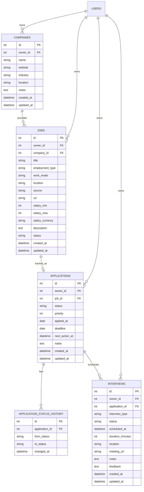

# JobTrack 后端改造与学习规划

> 项目定位：基于现有 FastAPI Production API 模板，逐步改造成一个可运行、可测试、可部署，并且能够经得起后端面试追问的求职投递管理系统。

## 当前进度

- 阶段 0 已完成：删除会回显密码的占位接口，统一数据库依赖和当前用户接口。
- 阶段 1 已完成：建立独立 PostgreSQL 测试库、安全校验、用例隔离和可复用 fixture。
- 阶段 2 已完成：Companies 的 Model、migration、Schema、Repository、Service、Router 和权限测试已形成完整纵向切片。
- 阶段 3 已完成：Jobs 职位管理、父子资源归属校验、薪资约束、筛选排序和公司删除冲突已实现。
- 阶段 4 已完成：Applications 投递流程、显式状态机、原子状态历史、筛选排序和跨用户权限隔离已实现。
- 阶段 5 已完成：Interviews 面试安排、UTC 时间处理、时间冲突检测、未来面试查询和反馈规则已实现。
- 阶段 6 已完成：Dashboard 聚合统计、Redis cache-aside、短 TTL、用户级安全缓存键、写后失效和故障回退已实现。
- 阶段 7 已完成：owner 查询审计、分页上限、EXPLAIN 索引验证、用户级写限流、低基数业务指标、安全日志、并发状态锁测试和 authenticated CRUD 压测场景已完成。
- 阶段 8 已完成：README、架构图、ADR、显式演示数据、演示流程、面试材料、Compose 一键启动和 CI 发布门禁均已验证。
- 当前全量测试为 376 passed，覆盖率 92.47%，PostgreSQL 和 Redis 集成测试全部通过。
- 核心规划已全部完成；下一步进入演示、代码审阅和按实际需求选择增强项。

## 1. 规划目标

这个项目的目标不是堆功能，而是完成一条可信的后端工程链路：

1. 用户可以安全地注册、登录并管理自己的数据。
2. 用户可以管理公司、职位、投递和面试。
3. 不同用户的数据必须严格隔离，不能通过猜测 ID 越权访问。
4. 数据库结构通过 Alembic 迁移演进，不能依赖手工建表。
5. 关键业务有自动化测试，失败事务能够回滚。
6. Redis、日志、指标等基础设施用于真实场景，而不是只写在技术栈列表里。
7. README、架构图和 API 示例能够支持项目演示和面试讲解。

完成后，项目应能回答这些核心面试问题：

- 一个 HTTP 请求怎样经过中间件、依赖、路由、服务、仓库并访问数据库？
- Schema 和 ORM Model 为什么要分开？
- JWT 只解决了什么问题，数据权限又是在哪里保证的？
- 事务边界应该放在哪里，失败时如何回滚？
- 为什么需要数据库索引、外键、唯一约束和迁移？
- Redis 缓存什么、为什么缓存、何时失效？
- 如何测试认证、越权、冲突和事务失败？
- 如何观察线上错误、慢请求和依赖故障？

## 2. 当前项目真实状态

### 2.1 已经具备的能力

当前模板已经提供了较完整的生产基础设施：

- FastAPI 应用装配、Swagger 和 OpenAPI。
- PostgreSQL、同步 SQLAlchemy 2.x 和 Alembic。
- bcrypt 密码哈希。
- JWT access token 和旋转 refresh token。
- 当前用户解析、用户状态检查和管理员权限。
- 邮箱验证、密码重置、TOTP MFA 和 OIDC 登录示例。
- Redis 限流和 OIDC 公钥缓存。
- 结构化请求日志、request ID、Prometheus 指标和 OpenTelemetry。
- 事务发件箱和后台邮件 worker。
- Dockerfile、Docker Compose、GitHub Actions 和依赖审计。
- 约 260 个现有测试函数，覆盖认证、安全和运维能力。

这些能力应优先复用，不重新手写 JWT、密码哈希、限流器或追踪系统。

### 2.2 当前结构中的问题

开始新增业务模块前，需要正视以下技术债：

1. `src/app/api/v1/users.py` 是教学占位接口。
   它调用的 `UserService` 和 `UserRepository` 不访问数据库，只把输入原样返回，甚至可能把密码字段返回给客户端。
2. 数据库依赖重复存在于：
   - `src/app/db/dependency.py`
   - `src/app/dependencies/database.py`
3. 当前用户接口重复存在：
   - 正式接口 `GET /auth/me`
   - 独立的 `GET /me/`
   - 一个隐藏的兼容路由
4. `api/v1` 只是目录名，目前大部分路由并没有统一的 `/api/v1` URL 前缀。
5. 模板说明自己采用分层架构，但现有注册和管理接口仍然直接在 Router 中查询和提交数据库。
6. 当前测试直接使用配置中的 PostgreSQL，并在全局 fixture 中创建固定管理员，测试隔离还有改进空间。
7. 不同模型的时间字段对时区处理不完全一致。JobTrack 新模型应统一使用带时区的 UTC 时间。

这些问题不要求一次性重构整个认证系统。原则是先移除明显不安全的占位链路，再为新增业务建立统一规范。

## 3. 明确不做什么

为了控制范围，第一版不做以下内容：

- 不把同步 SQLAlchemy 改成异步。仓库已有 ADR，当前没有性能证据支持这项重构。
- 不拆微服务。单体应用足以承载当前业务，也更适合展示清晰的事务边界。
- 不重新实现现有认证系统。
- 不在第一阶段开发前端。
- 不引入 Elasticsearch、Kafka、Celery 等没有明确需求的组件。
- 不为每个表机械地创建复杂抽象或通用基类。
- 不把 Redis 当作数据库，也不缓存强一致性要求高的写操作。

## 4. 目标业务范围

### 4.1 核心用户故事

登录用户应该能够：

1. 维护目标公司。
2. 为公司记录招聘职位。
3. 把职位加入投递流程并更新投递状态。
4. 为一次投递安排多轮面试。
5. 查看投递漏斗、近期面试和待办事项。
6. 按状态、公司、关键字和时间筛选数据。

### 4.2 核心数据模型



### 4.3 关键建模决策

- 所有业务资源都带 `owner_id`，直接关联 `users.id`。
- `owner_id` 永远从 `get_current_user` 获取，不允许客户端提交。
- 查询、更新和删除必须同时过滤资源 ID 与 `owner_id`。
- 访问不存在或属于其他用户的资源统一返回 `404`，避免泄露资源是否存在。
- 新模型统一使用 `DateTime(timezone=True)` 和 UTC。
- 状态先使用字符串加 Python Enum、Pydantic 校验和数据库 Check Constraint，避免 PostgreSQL Enum 难迁移的问题。
- 金额使用整数最小货币单位或 `Numeric`，绝不使用浮点数。具体方案在 Jobs 阶段确认。
- 公司存在职位时，默认不允许物理删除公司，返回 `409`；后续可增加归档能力。
- 职位存在投递时，默认不允许物理删除职位。
- 一条职位对一个用户最多对应一条投递，通过唯一约束保证。
- 修改投递状态时，在同一事务中写入状态历史。

## 5. 新业务模块的统一分层

新模块采用下面的依赖方向：

```text
HTTP Request
    -> Router
    -> Service
    -> Repository
    -> SQLAlchemy Session / Model
    -> PostgreSQL
```

职责划分：

| 层 | 主要职责 | 不应该做什么 |
| --- | --- | --- |
| Router | 接收参数、声明依赖、选择状态码、返回 Schema | 不直接写复杂 SQL，不承载业务规则 |
| Schema | 校验请求和约束响应字段 | 不访问数据库 |
| Service | 权限规则、状态流转、跨表操作、事务提交 | 不处理 Request/Response 对象 |
| Repository | 封装查询、`add`、`flush`、锁和分页 | 默认不自行 `commit` |
| Model | 表、字段、外键、索引、约束 | 不依赖 FastAPI |
| Migration | 数据库结构的可重复升级和降级 | 不依赖应用启动时自动建表 |

事务规则：

- Service 是新增业务的事务边界。
- Repository 可以 `add`、查询和 `flush`，但不擅自 `commit`。
- Service 完成全部业务修改后统一 `commit`。
- 任何异常都要 `rollback`，再抛出安全、可预测的错误。
- 单次请求只使用 `Depends(get_db)` 提供的一个 Session。

## 6. API 设计约定

新业务 API 统一使用 `/api/v1` 前缀。现有认证 URL 第一阶段保持兼容，避免在业务开发前大范围破坏已有安全测试；最终阶段再决定是否增加版本化别名。

通用约定：

- 创建成功：`201 Created`
- 查询和更新成功：`200 OK`
- 删除成功且无响应体：`204 No Content`
- 请求数据不合法：`422 Unprocessable Entity`
- 未登录或 token 无效：`401 Unauthorized`
- 已登录但无系统级权限：`403 Forbidden`
- 资源不存在或不属于当前用户：`404 Not Found`
- 唯一约束、非法状态迁移或删除冲突：`409 Conflict`
- 列表接口统一支持分页，并限制最大 `page_size`。
- 列表排序字段采用白名单，不直接把客户端字符串拼进 SQL。
- 响应 Schema 不暴露 ORM 内部字段和敏感字段。

第一版接口范围：

```text
POST   /api/v1/companies
GET    /api/v1/companies
GET    /api/v1/companies/{company_id}
PATCH  /api/v1/companies/{company_id}
DELETE /api/v1/companies/{company_id}

POST   /api/v1/jobs
GET    /api/v1/jobs
GET    /api/v1/jobs/{job_id}
PATCH  /api/v1/jobs/{job_id}
DELETE /api/v1/jobs/{job_id}

POST   /api/v1/applications
GET    /api/v1/applications
GET    /api/v1/applications/{application_id}
PATCH  /api/v1/applications/{application_id}
PATCH  /api/v1/applications/{application_id}/status
DELETE /api/v1/applications/{application_id}
GET    /api/v1/applications/{application_id}/history

POST   /api/v1/applications/{application_id}/interviews
GET    /api/v1/applications/{application_id}/interviews
GET    /api/v1/interviews/{interview_id}
PATCH  /api/v1/interviews/{interview_id}
DELETE /api/v1/interviews/{interview_id}

GET    /api/v1/dashboard/summary
GET    /api/v1/dashboard/upcoming
```

## 7. 分阶段实施计划

### 阶段 0：建立基线并清理明显问题

目标：确保后续功能建立在可解释、不会泄露敏感数据的基础上。

任务：

- 记录当前完整测试结果和覆盖率。
- 删除或停止注册占位的 `/users/` 创建接口。
- 移除无效的 `UserService/UserRepository`，或明确保留为待实现代码但不暴露 HTTP 接口。
- 统一使用 `app.db.dependency.get_db`，删除重复数据库依赖。
- 保留 `/auth/me` 作为正式当前用户接口，处理 `/me/` 和隐藏兼容路由。
- 给现有认证接口补充必要的回归测试，确保清理没有改变登录链路。
- 更新应用名称、描述和 Swagger 标签为 JobTrack，但暂不改动 token 语义。

需要理解：

- 为什么返回请求 Schema 可能泄露密码。
- 为什么重复依赖会造成维护分叉。
- 为什么重构前要先建立测试基线。

验收标准：

- 注册、登录、刷新 token、`/auth/me` 仍正常。
- 不存在会回显明文密码的公开接口。
- 全项目只保留一个 `get_db` 定义。
- Ruff 和相关测试通过。

### 阶段 1：改进测试基础设施

目标：保证 JobTrack 测试不会污染开发数据，并能稳定测试权限隔离。

任务：

- 明确本地测试数据库配置，例如独立的 `fastapi_test` 数据库。
- 在测试中覆盖 `get_db` 依赖，避免测试误连生产或日常开发数据库。
- 建立可复用 fixture：
  - `db_session`
  - `client`
  - `user_factory`
  - `auth_headers`
  - `second_user`
- 每个测试使用事务回滚或可靠的数据清理策略。
- 保留真实 PostgreSQL 测试，不用 SQLite 替代 PostgreSQL 行为。
- 给工厂生成唯一用户名和邮箱，避免测试顺序依赖。

需要理解：

- 单元测试、集成测试和端到端测试的区别。
- FastAPI dependency override 的作用。
- 为什么 SQLite 不能完整替代 PostgreSQL 测试。

验收标准：

- 测试可重复运行两次，结果一致。
- 测试失败后不会残留影响下次运行的数据。
- 可以方便地创建两个登录用户测试越权场景。

### 阶段 2：Companies 完整纵向切片

目标：用最小业务模块走通 Model 到 Swagger 的完整链路，并把它作为后续模块模板。

新增或修改文件：

```text
src/app/models/company.py
src/app/schemas/company.py
src/app/repositories/company_repository.py
src/app/services/company_service.py
src/app/api/v1/companies.py
src/app/models/__init__.py
src/app/main.py
alembic/versions/<revision>_create_companies.py
tests/test_companies.py
```

任务：

- 创建 Company ORM Model、外键、索引和时间字段。
- 在 `models/__init__.py` 和 Alembic 环境中确保 metadata 能发现模型。
- 生成迁移后人工检查 upgrade 和 downgrade。
- 创建 `CompanyCreate`、`CompanyUpdate`、`CompanyResponse` 和列表响应 Schema。
- Repository 实现仅当前用户范围内的创建、详情、列表、更新和删除查询。
- Service 处理重名冲突、资源归属和事务。
- Router 使用 `Depends(get_current_user)` 和 `Depends(get_db)`。
- 列表支持关键字、行业、所在地、分页和稳定排序。

必要测试：

- 未登录不能访问。
- 创建成功并自动绑定当前用户。
- 请求体中的多余 `owner_id` 不能改变归属。
- 用户只能看到自己的公司。
- 用户 A 不能读取、修改或删除用户 B 的公司。
- 更新部分字段时，未提交字段保持不变。
- 非法 URL、空名称和超长字符串返回校验错误。
- 重名或数据库冲突返回稳定错误，并正确 rollback。
- 没有下游数据时，公司可以正常删除；“有职位时禁止删除”在 Jobs 阶段补测。

验收标准：

- Alembic 可以从上一版本升级到新版本，也能单步 downgrade 后重新 upgrade。
- Swagger 可以完成公司 CRUD。
- 公司越权测试全部通过。
- Router 中没有直接的复杂数据库查询。

### 阶段 3：Jobs 职位管理

目标：引入父子资源、金额字段、筛选和删除约束。

任务：

- 建立 Job Model 和 migration。
- 定义 employment type、work mode 和 job status 枚举。
- 创建职位时验证 company 属于当前用户。
- 支持按公司、状态、工作模式和关键字筛选。
- 支持创建时间、更新时间和薪资排序。
- 对薪资范围增加约束：最小值不能大于最大值。
- 公司详情可选择返回职位数量，但避免默认加载完整职位列表。
- 删除存在投递的职位时返回 `409`。

需要理解：

- 外键和应用层校验各自解决什么问题。
- N+1 查询是什么，什么时候使用 join 或 selectinload。
- 索引为什么应匹配常用过滤条件。
- 金额为什么不能使用 float。

必要测试：

- 不能给别人的公司创建职位。
- 列表过滤不会返回其他用户数据。
- 薪资范围和枚举校验正确。
- 不存在、越权和删除冲突的响应一致。
- 公司存在职位时不能直接删除，并返回 `409`。

### 阶段 4：Applications 投递流程

目标：实现项目最核心的业务规则和事务能力。

建议状态：

```text
saved -> applied -> screening -> interview -> offer
                           \-> rejected
任意非终态 -> withdrawn
终态 -> archived
```

最终允许的状态迁移需要写成显式映射，而不是允许任意字符串互相转换。

任务：

- 建立 Application 和 ApplicationStatusHistory Model。
- 同一用户对同一职位只允许一条投递。
- 创建投递时验证职位归属。
- 单独提供状态变更接口，普通资料更新不能偷偷改变状态。
- 状态变化与历史记录在同一事务中提交。
- 支持按状态、公司、日期范围、优先级和待办时间筛选。
- 支持分页和白名单排序。
- 明确 `applied_at` 在进入 `applied` 状态时的默认规则。

需要理解：

- 什么是业务不变量。
- 为什么数据库约束和 Service 校验要同时存在。
- 为什么状态变更和历史记录必须原子提交。
- 并发更新可能导致什么问题。

必要测试：

- 重复投递冲突。
- 合法状态迁移成功。
- 非法状态迁移返回 `409`。
- 历史记录正确保存 from/to 状态。
- 历史写入失败时，Application 状态也回滚。
- 两个用户之间不存在任何读写越权。

### 阶段 5：Interviews 面试安排

目标：处理时间、子资源和未来事件查询。

任务：

- 建立 Interview Model 和 migration。
- 面试必须属于当前用户的一条 Application。
- `scheduled_at` 必须是带时区时间，并统一存储为 UTC。
- 限制合理的 `duration_minutes`。
- 支持 scheduled、completed、cancelled 状态。
- 支持未来面试列表，并按时间升序排列。
- 可选：完成面试后填写 feedback。

需要理解：

- UTC 存储与客户端时区展示的边界。
- 嵌套路由与顶层资源路由的取舍。
- 为什么列表查询需要稳定的次级排序字段。

必要测试：

- 不能给别人的投递创建面试。
- 时区输入和输出正确。
- 未来面试不包含已取消记录。
- 更新、取消和删除权限正确。

### 阶段 6：Dashboard 统计与 Redis 缓存

目标：让 Redis 服务于明确的读性能场景，而不是为了技术栈而使用。

统计内容：

- 公司总数。
- 职位总数。
- 各投递状态数量。
- 最近 7 天投递数。
- Offer 转化率。
- 未来 7 天面试。
- 已到期和即将到期的待办。

缓存策略：

- Key 使用版本和用户 ID 的安全摘要，不暴露原始敏感信息。
- 只缓存 dashboard 聚合结果，设置较短 TTL，例如 30 到 60 秒。
- 公司、职位、投递和面试发生写操作后，失效当前用户的 dashboard cache。
- Redis 不可用时回退数据库查询，不能让核心 CRUD 不可用。
- 防止缓存穿透和无限 key 增长。

需要理解：

- cache-aside 流程。
- TTL 和主动失效各自解决什么问题。
- 缓存一致性为什么通常是权衡，而不是绝对同步。
- 为什么不能使用用户 ID、状态等高基数字段作为 Prometheus label。

必要测试：

- 首次 miss 查询数据库并写缓存。
- 第二次 hit 不重复执行聚合查询。
- 写操作后缓存失效。
- Redis 异常时正确回退。
- 不同用户使用不同缓存项。

### 阶段 7：安全、性能和可观测性加固

目标：把“能用”提升到“能解释如何稳定运行”。

任务：

- 审计所有资源查询是否包含 owner 条件。
- 为列表接口增加最大分页限制。
- 为常用查询执行 `EXPLAIN ANALYZE`，确认索引是否命中。
- 根据真实查询添加复合索引，例如：
  - `(owner_id, created_at)`
  - `(owner_id, status, updated_at)`
  - `(owner_id, scheduled_at)`
- 对关键写接口增加用户级限流策略。
- 增加低基数业务指标：创建结果、状态迁移结果、缓存结果。
- 日志记录资源类型、操作和结果，但不记录 token、简历内容、备注正文或邮箱。
- 评估并发状态更新，必要时增加乐观锁版本字段。
- 增加数据库故障、Redis 故障和事务回滚测试。
- 使用现有 k6 基础设施新增 authenticated CRUD 场景。

验收标准：

- 常见列表查询有可说明的索引依据。
- 错误日志可以通过 request ID 定位。
- Redis 和 tracing 失败不会破坏核心业务正确性。
- 测试覆盖率保持在项目要求的 90% 以上。

### 阶段 8：项目包装、部署与面试材料

目标：让项目成为个人作品，而不是带少量修改的模板仓库。

任务：

- 重写 README：项目简介、功能、架构、快速启动、测试和 API 示例。
- 明确标注模板来源、保留的基础能力以及本人新增的业务设计。
- 更新 APP_NAME、包描述、Swagger 描述和示例环境变量。
- 增加 JobTrack ER 图和请求流程图。
- 增加 `docs/decisions/` ADR：
  - 为什么保留同步 SQLAlchemy。
  - 为什么 Service 管事务、Repository 不 commit。
  - 为什么 dashboard 使用短 TTL cache-aside。
  - 为什么越权资源返回 404。
- 增加演示数据脚本，确保只在明确命令下运行。
- 给出完整演示流程：注册、登录、创建公司、职位、投递、面试、查看统计。
- 确认 Docker Compose 一键启动和迁移。
- 确认 GitHub Actions 执行 lint、测试、迁移、依赖审计和镜像构建。
- 准备项目讲解稿和常见追问答案。

最终演示顺序：

```text
启动 PostgreSQL 和 Redis
-> Alembic upgrade
-> 启动 API
-> Swagger 注册和登录
-> 创建 Company 和 Job
-> 创建 Application 并流转状态
-> 安排 Interview
-> 查看 Dashboard
-> 展示越权测试和事务回滚测试
-> 展示日志、指标与 CI
```

完成记录（2026-09-22）：

- README 已明确模板来源、保留能力和 JobTrack 新增设计，并提供快速启动、API、测试与局限说明。
- `ARCHITECTURE.md` 已包含 ER 图和认证请求流程；五份 ADR 已记录关键架构取舍。
- `scripts/seed_demo.py` 只接受显式 `--confirm`，并拒绝生产、远程及非演示数据库。
- `DEMO.md` 和 `INTERVIEW_GUIDE.md` 已覆盖完整演示顺序、项目讲解与常见追问。
- Compose 已实测完成镜像构建、Alembic one-shot migration、非 root API 启动和 live/ready 健康检查。
- CI 契约测试覆盖 lint、format、migration、pytest、依赖审计、构建及容器健康检查。
- 依赖审计发现并修复 `httpx2/httpcore2` 漏洞；最终审计无已知漏洞。
- 最终验证：376 passed，覆盖率 92.47%，Ruff 和发行包构建通过。

## 8. 测试矩阵

每个业务模块至少覆盖以下维度：

| 维度 | 必测内容 |
| --- | --- |
| Happy path | 创建、读取、更新、删除或归档成功 |
| Authentication | 无 token、过期 token、无效 token |
| Ownership | 用户 A 不能操作用户 B 的资源 |
| Validation | 空值、超长值、非法枚举、非法 URL、非法时间 |
| Not found | 不存在 ID 返回一致的 404 |
| Conflict | 重复数据、非法状态迁移、外键删除冲突 |
| Transaction | 中途失败后数据全部回滚 |
| Filtering | 多条件组合仍然强制 owner 过滤 |
| Pagination | 边界页、最大 page size、稳定排序 |
| Infrastructure | PostgreSQL、Redis 或外部依赖失败时的行为 |

测试层次建议：

- Schema 单元测试：验证字段和边界。
- Service 单元测试：重点验证状态机和事务决策。
- Repository 集成测试：使用真实 PostgreSQL 验证 SQL、约束和锁。
- API 集成测试：从 HTTP 层验证认证、响应结构和状态码。
- 少量 k6 测试：验证关键链路在并发下没有明显错误。

## 9. Alembic 工作流程

每次数据库结构变化采用固定流程：

```bash
uv run --python 3.13 alembic current
uv run --python 3.13 alembic heads
uv run --python 3.13 alembic revision --autogenerate -m "create companies"
uv run --python 3.13 alembic upgrade head
```

生成迁移后必须人工检查：

- `down_revision` 是否连接当前唯一 head。
- 表名和约束名是否清晰。
- 外键的 `ondelete` 是否符合业务语义。
- server default 是否能让已有行安全迁移。
- 索引是否真的服务查询，而不是机械添加。
- downgrade 是否可以撤销本次变更。
- Model 的 metadata 是否已被 `alembic/env.py` 加载。

不要在应用启动时使用 `Base.metadata.create_all()` 代替迁移。

## 10. 每阶段固定完成清单

每完成一个模块，都按同一顺序检查：

1. 先写清业务规则和不变量。
2. 设计 Model、外键、索引和约束。
3. 生成并审查 migration。
4. 编写请求和响应 Schema。
5. 编写 Repository 查询。
6. 编写 Service 和事务。
7. 编写 Router 和依赖。
8. 注册 Router，检查 OpenAPI。
9. 完成成功、失败、越权和回滚测试。
10. 运行 Ruff、pytest 和 Alembic 检查。
11. 用 Swagger 手工走一遍真实流程。
12. 更新 API 示例和项目文档。

常用质量命令：

```bash
uv run --python 3.13 ruff check .
uv run --python 3.13 ruff format --check .
uv run --python 3.13 pytest
uv run --python 3.13 alembic upgrade head
uv run --python 3.13 python scripts/dev.py check
```

## 11. 面试讲解主线

面试时不要从“用了哪些技术”开始，而应按问题、设计和取舍讲：

1. 项目解决什么问题：集中跟踪公司、职位、投递状态和面试安排。
2. 为什么选择单体 FastAPI：规模有限、事务边界清晰、部署简单。
3. 如何认证：短期 JWT access token 加可撤销的旋转 refresh token。
4. 如何授权：每个查询都绑定当前用户的 owner ID，越权资源返回 404。
5. 如何组织代码：Router 负责 HTTP，Service 负责业务和事务，Repository 负责查询。
6. 如何保证数据一致：外键、唯一约束、Check Constraint 和事务共同保证。
7. 如何演进数据库：所有结构变化都经过可审查的 Alembic migration。
8. 如何测试：真实 PostgreSQL、双用户越权用例、失败回滚和 API 集成测试。
9. Redis 为什么存在：缓存用户 dashboard 聚合，并在写操作后失效；失败时回退数据库。
10. 如何上线和排错：Docker、CI、健康检查、结构化日志、指标和 request ID。

需要准备的重点追问：

- 为什么不用 async SQLAlchemy？
- JWT 被盗后怎么办？logout 为什么不能立即让 access token 失效？
- 为什么权限条件要写进 SQL，而不是查出来后再判断？
- Service 和 Repository 是否一定需要？何时属于过度设计？
- offset 分页数据量大时有什么问题，何时改 cursor pagination？
- dashboard 缓存如何避免脏数据？
- 两个请求同时修改投递状态怎么办？
- 删除公司为什么不是简单 cascade？
- 如果要发送面试提醒，怎样利用事务发件箱避免数据库成功但消息丢失？

## 12. 可选增强项

核心阶段全部完成后，再从以下内容中选择，不要求全部实现：

- 联系人和内推人管理。
- 标签和自定义来源。
- 简历版本与投递关联，只保存对象存储引用，不把大文件塞进数据库。
- 日历导出或第三方日历同步。
- 基于 transactional outbox 的面试提醒。
- CSV 导入和导出。
- 审计日志。
- 全文搜索。
- Cursor pagination。
- 乐观锁和幂等键。

选择增强项的标准是：它必须展示一个真实后端问题及其解决方案，而不是单纯增加接口数量。

## 13. 推荐学习与实施节奏

一次只完成一个可以验证的小闭环：

```text
第 1 个闭环：清理占位接口和重复依赖
第 2 个闭环：Company Model + migration
第 3 个闭环：Company create + get
第 4 个闭环：Company list + update + delete
第 5 个闭环：Company 完整测试
第 6 个闭环：Jobs
第 7 个闭环：Applications + 状态历史
第 8 个闭环：Interviews
第 9 个闭环：Dashboard + Redis
第 10 个闭环：性能、安全、文档和演示
```

每个闭环都要能回答四个问题：

- 请求从哪里进入？
- 数据在哪里校验？
- 权限和事务在哪里保证？
- 哪个测试证明它真的有效？

## 14. 最终完成标准

只有同时满足以下条件，JobTrack 才算完成：

- 核心业务接口全部要求登录，并完成用户数据隔离。
- Model、migration 和数据库实际结构一致。
- 核心状态流转有明确规则和历史记录。
- Swagger 能完成完整演示流程。
- 自动化测试覆盖成功、失败、越权、冲突和回滚。
- 覆盖率达到项目门槛，Ruff、依赖审计和构建通过。
- Docker Compose 可以在干净环境启动数据库、Redis、迁移和 API。
- README 能让其他开发者独立启动项目。
- 文档清楚区分模板原有能力和 JobTrack 新增工作。
- 能在 5 到 10 分钟内讲清架构、关键取舍和一个最有价值的技术难点。

## 15. 立即执行的下一步

阶段 0 至阶段 8 已全部完成。建议按以下顺序使用和继续演进项目：

1. 按 `DEMO.md` 用 Swagger 完整演示一次，控制在 5 到 10 分钟。
2. 按 `INTERVIEW_GUIDE.md` 练习讲清 owner 隔离、事务、状态锁和缓存降级四个关键取舍。
3. 提交前运行 `python scripts/dev.py check`，并在干净环境复验 `python scripts/dev.py stack-up`。
4. 根据真实需求从“可选增强项”中只选择一个新闭环，例如 outbox 面试提醒或 cursor pagination。
5. 若准备公开仓库，替换模板仓库 URL、作者信息和徽章为自己的仓库元数据。
