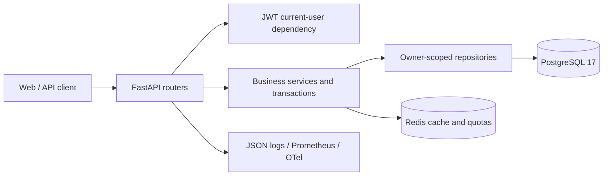

# JobTrack API

[](https://github.com/nkuers/jobtrack-api/actions/workflows/ci.yml)
[](https://www.python.org/)
[](https://fastapi.tiangolo.com/)
[](https://www.postgresql.org/)
[](LICENSE)

JobTrack is a production-oriented backend for organizing companies, job
opportunities, applications, status history, interviews, follow-up actions, and
personal funnel statistics.

The project focuses on the backend questions that appear after basic CRUD:
owner isolation, state-machine invariants, transaction boundaries, concurrent
updates, time zones, query/index design, cache consistency, rate limiting,
failure recovery, and operational evidence.

## What JobTrack can do

- manage owner-scoped Companies and Jobs with filters, pagination, salary
  validation, and safe parent deletion rules;
- track one Application per Job through an explicit status machine;
- write every status transition to history in the same database transaction;
- schedule multi-round Interviews using timezone-aware UTC timestamps and a
  PostgreSQL-enforced no-overlap invariant;
- show a Dashboard with status counts, recent applications, Offer conversion,
  upcoming Interviews, and due/overdue actions;
- cache only the Dashboard aggregate with short-TTL Redis cache-aside and
  PostgreSQL fallback;
- protect every private resource lookup with authenticated `owner_id`;
- expose structured request/business logs, request IDs, Prometheus metrics,
  health probes, and optional OpenTelemetry traces;
- run against real PostgreSQL in tests with Alembic-managed schema evolution.

## Project lineage

This repository started from the
[`fastapi-production-api`](https://github.com/HoungDev/fastapi-production-api)
template. The retained foundation includes JWT and rotating refresh tokens,
device sessions, RBAC, email verification/password reset, optional MFA and
OIDC, PostgreSQL/Alembic, Redis integration, security middleware, tracing,
transactional email outbox, Docker, and CI.

The JobTrack-specific work adds the complete Companies → Jobs → Applications →
Interviews domain, status history and locking, Dashboard aggregation/cache,
owner-scoped repositories, business rate limits and telemetry, migrations,
integration tests, query-plan evidence, demo tooling, and project documentation.
This distinction is intentional: the project demonstrates extending a mature
foundation safely rather than claiming every infrastructure component was
written from scratch.

## Architecture



```text
HTTP request
  -> security, rate-limit and request-ID middleware
  -> authentication dependency
  -> Router / Pydantic schema
  -> Service / transaction boundary
  -> Repository / owner-scoped SQL
  -> PostgreSQL
  -> best-effort Dashboard cache invalidation
```

The full ER diagram, request sequence, transaction rules, and trust boundaries
are in [ARCHITECTURE.md](ARCHITECTURE.md).

## Quick start

Requirements:

- Python 3.13+
- [uv](https://docs.astral.sh/uv/)
- Docker with Compose

Prepare dependencies, start PostgreSQL/Redis, and apply migrations:

```bash
git clone <your-jobtrack-repository-url>
cd jobtrack-api
python scripts/dev.py setup
```

Start the API with reload:

```bash
python scripts/dev.py serve
```

Open:

- Swagger UI: <http://127.0.0.1:8000/docs>
- ReDoc: <http://127.0.0.1:8000/redoc>
- readiness: <http://127.0.0.1:8000/health/ready>
- Prometheus metrics: <http://127.0.0.1:8000/metrics>

Alternatively, build and start the complete stack. Compose runs the one-shot
migration service before the API becomes eligible to start:

```bash
python scripts/dev.py stack-up
```

## Optional demonstration data

Demo data is never inserted during startup or migration. The following explicit
command refuses production and non-local databases:

```bash
python scripts/dev.py demo-data --confirm
```

It creates a disposable `jobtrack_demo` user with Companies, Jobs,
Applications, status history, Interviews, and Dashboard-ready actions. Follow
[DEMO.md](DEMO.md) for the complete Swagger presentation and security evidence.

## Core API

All business endpoints require an access token.

| Method | Path | Purpose |
| --- | --- | --- |
| `GET` | `/auth/me` | Resolve the authenticated user |
| `POST/GET` | `/api/v1/companies` | Create and search target companies |
| `GET/PATCH/DELETE` | `/api/v1/companies/{id}` | Manage one owned company |
| `POST/GET` | `/api/v1/jobs` | Create and filter job opportunities |
| `GET/PATCH/DELETE` | `/api/v1/jobs/{id}` | Manage one owned job |
| `POST/GET` | `/api/v1/applications` | Create and filter applications |
| `PATCH` | `/api/v1/applications/{id}/status` | Apply a validated state transition |
| `GET` | `/api/v1/applications/{id}/history` | Read ordered transition history |
| `POST/GET` | `/api/v1/interviews` | Schedule and list interview rounds |
| `GET` | `/api/v1/interviews/upcoming` | Read future scheduled interviews |
| `GET` | `/api/v1/dashboard` | Read the cached owner-scoped aggregate |

See [API_EXAMPLES.md](API_EXAMPLES.md) for curl examples and `/docs` for the
generated request/response contracts.

## Important business rules

- `owner_id` always comes from the authenticated user, never the request body.
- Missing and foreign-owned resources both return `404`.
- Company deletion is blocked while Jobs exist; Job deletion is blocked while
  an Application exists; Application deletion is blocked while Interviews
  exist.
- One user can create at most one Application for a Job.
- Ordinary Application metadata updates cannot change status.
- Status change and history insertion are atomic and use `FOR UPDATE` to
  serialize concurrent transitions.
- New Interviews can only be scheduled while their Application is in
  `screening`, `interview`, or `offer` status.
- Interview timestamps require a timezone and are normalized to UTC.
- Scheduled Interviews for one user cannot overlap.
- Redis failure does not make Dashboard or core CRUD unavailable.

The accepted decisions begin with
[the synchronous SQLAlchemy ADR](docs/decisions/0001-keep-sync-sqlalchemy.md).

## Tests and quality gates

Run the isolated PostgreSQL test suite:

```bash
python scripts/dev.py test
```

Run the CI-equivalent local gate:

```bash
python scripts/dev.py check
```

The suite covers authentication, ownership, validation, conflicts, transaction
rollback, filtering, pagination, PostgreSQL constraints/locking, Redis failure,
cache behavior, logging, tracing, and operations. Coverage must remain at or
above 90%; SQLite is not substituted for PostgreSQL behavior.

GitHub Actions runs:

1. Ruff lint and format checks;
2. Alembic upgrade;
3. pytest with coverage artifact;
4. sync/async database benchmark correctness smoke;
5. dependency audit;
6. wheel build and isolated import smoke;
7. non-root production image build and live/ready smoke test.

## Performance and resilience

- Common owner/status/time-window queries use matching compound indexes.
- List sizes are bounded and sorting uses stable ID tie-breakers.
- Application status changes use a pessimistic row lock.
- Business writes have a per-user quota in addition to the client-address
  middleware limit.
- Dashboard uses one HMAC-derived cache key per user with a short TTL.
- Metrics use bounded labels and never put usernames or user IDs in label
  values.

The recorded PostgreSQL plans and security audit are in
[JOBTRACK_HARDENING.md](JOBTRACK_HARDENING.md). The k6 `crud` profile is
documented in [LOAD_TESTING.md](LOAD_TESTING.md).

## Repository layout

```text
src/app/api/v1/       HTTP routers
src/app/schemas/      Pydantic request/response contracts
src/app/services/     Business rules and transaction boundaries
src/app/repositories/ Owner-scoped SQLAlchemy queries
src/app/models/       ORM tables and database constraints
alembic/versions/     Ordered schema migrations
scripts/              Development and explicit demo commands
tests/                Unit and real PostgreSQL/Redis integration tests
docs/decisions/       Architecture decision records
load_tests/           Guarded k6 scenarios
```

## Documentation

| Guide | Purpose |
| --- | --- |
| [API examples](API_EXAMPLES.md) | Authentication and JobTrack curl flows |
| [Architecture](ARCHITECTURE.md) | ER model, request flow, layers and trust boundaries |
| [Demo](DEMO.md) | End-to-end presentation sequence |
| [Interview guide](INTERVIEW_GUIDE.md) | Project explanation and common follow-ups |
| [Hardening audit](JOBTRACK_HARDENING.md) | Ownership, indexes, concurrency and failure behavior |
| [Local development](DEVELOPMENT.md) | Setup, commands and configuration |
| [Deployment](DEPLOYMENT.md) | Production configuration and rollout |
| [Monitoring](MONITORING.md) | Probes, metrics, logs, traces and alerts |
| [Load testing](LOAD_TESTING.md) | Guarded k6 workloads and methodology |
| [Database benchmarks](DATABASE_BENCHMARKS.md) | Sync/async evidence and adoption gate |

## Known limitations

- The application is a backend API; it does not include a frontend.
- Offset pagination is appropriate for the current scope but should become
  cursor-based for deep, high-volume histories.
- Interview overlap is protected twice: the Service returns an early friendly
  conflict and a PostgreSQL GiST exclusion constraint closes concurrent races.
- Dashboard caching accepts a short stale-data window.
- TOTP is not phishing resistant; passkeys/WebAuthn are future work.
- Compose is intended for local evaluation. Production requires managed
  secrets, TLS/ingress, backups, retention policy, and platform monitoring.

## License

Distributed under the [MIT License](LICENSE).
